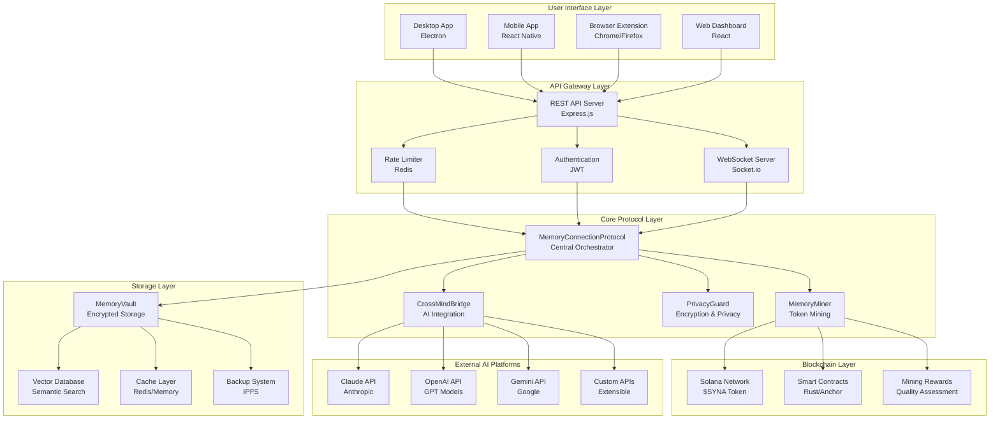
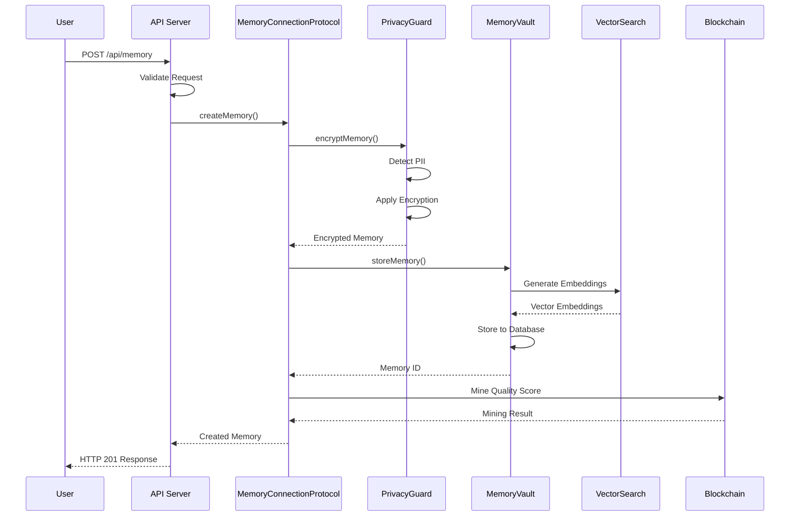
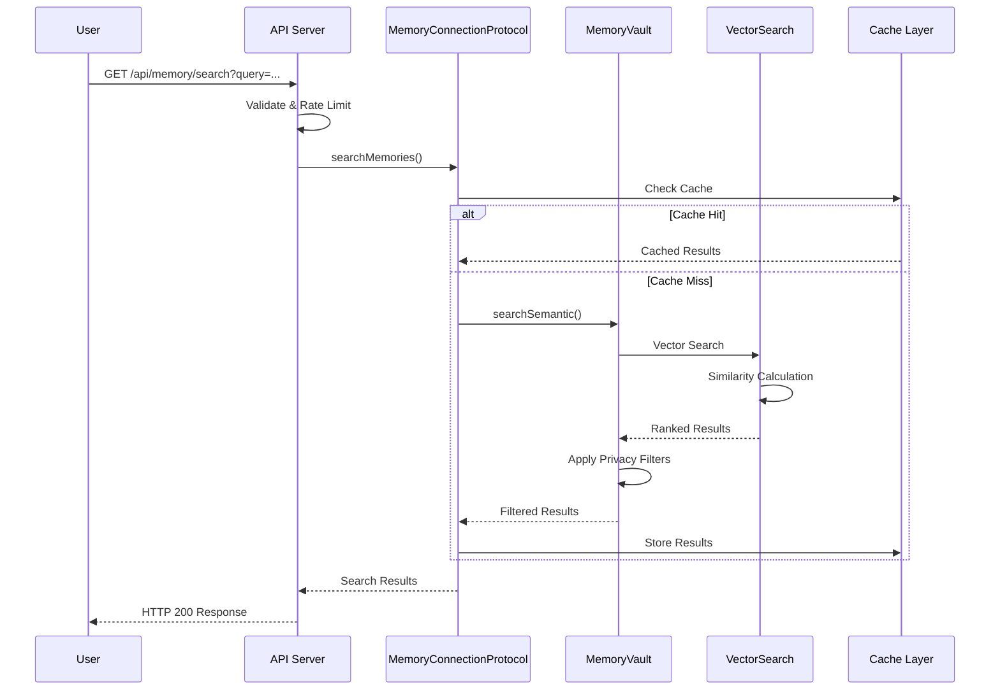
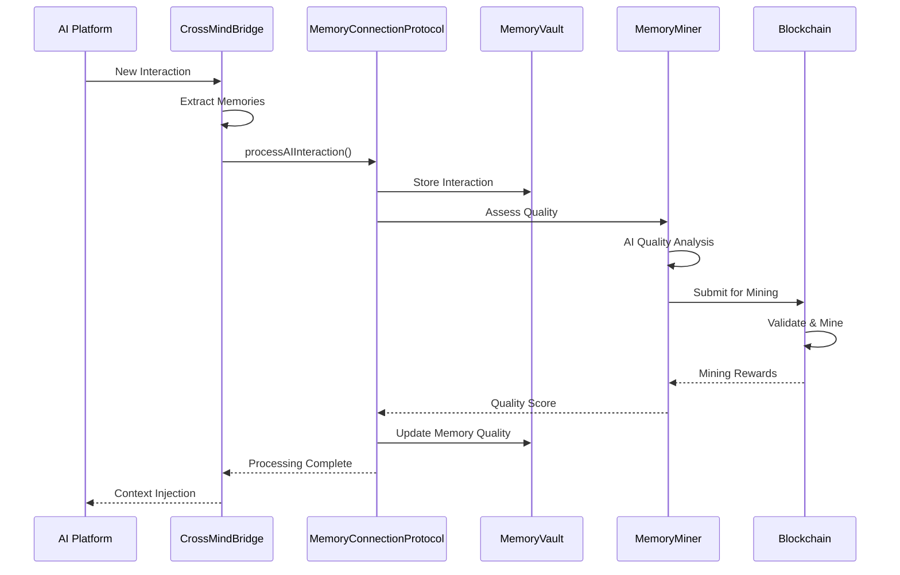

<div align="center">

# 🧠 Synaptic - Decentralized MCP

</div>

<div align="center">
  
</div>

<div align="center">

[](https://github.com/Synaptic-MCP/Synaptic)
[](LICENSE)
[](https://nodejs.org/)
[](https://www.typescriptlang.org/)
[](Dockerfile)
[](http://localhost:3000/api)

</div>

> **🚀 Making AI Truly Yours** - A revolutionary decentralized protocol that gives you complete control over your AI memories and interactions across all platforms.

## 🌟 What is Synaptic?

Synaptic is the world's first **Decentralized MCP** that solves the fundamental problem of AI memory fragmentation. Instead of your conversations and insights being trapped in isolated AI platforms, Synaptic creates a unified, encrypted, and user-owned memory layer that works across all AI tools.

### 🎯 Core Problems We Solve

- **🔗 Memory Fragmentation**: Your AI conversations are scattered across different platforms
- **👤 Data Ownership**: You don't control your AI interaction data
- **🔒 Privacy Concerns**: Your sensitive conversations are stored on corporate servers
- **🧠 Context Loss**: AI tools can't learn from your previous interactions on other platforms
- **💰 No Incentives**: You don't get rewarded for contributing quality data to AI ecosystems

## ✨ Key Features

### 🔐 Privacy-First Architecture
- **End-to-end encryption** with AES-256-GCM
- **Local-first storage** - your data stays on your devices
- **Zero-knowledge architecture** - we can't see your data even if we wanted to
- **Granular privacy controls** with 4-level privacy system

### 🤖 Universal AI Integration
- **Claude (Anthropic)** - Full conversation memory extraction
- **OpenAI (GPT)** - Complete interaction history
- **Google Gemini** - Native integration support
- **Cursor** - Development conversation memory
- **Windsurf** - AI coding assistant integration
- **Custom APIs** - Extensible adapter framework

### 🧠 Intelligent Memory Management
- **Semantic search** with vector embeddings
- **Automatic categorization** of memories by type and context
- **Quality assessment** with AI-powered scoring
- **Smart context injection** for relevant memory retrieval
- **Cross-platform memory synthesis**

### 💰 Token Economics & Rewards
- **$SYNA Token** - Native ecosystem currency on Solana
- **Quality-based mining** - earn tokens for valuable contributions
- **Decentralized governance** - token holders control protocol evolution

## 🏗️ System Architecture

### 📊 High-Level Architecture Diagram



### 🔧 Core Components Architecture

#### 1. 🧠 MemoryConnectionProtocol (Central Orchestrator)
```typescript
// Location: src/core/MemoryConnectionProtocol.ts (498 lines)
class MemoryConnectionProtocol {
  private memoryVault: MemoryVault;
  private crossMindBridge: CrossMindBridge;
  private privacyGuard: PrivacyGuard;
  private memoryMiner: MemoryMiner;
  
  // Core memory operations
  async createMemory(content: string, type: MemoryType, category: MemoryCategory): Promise<Memory>
  async searchMemories(query: string, options?: SearchOptions): Promise<Memory[]>
  async processAIInteraction(platform: AIPlatform, prompt: string, response: AIResponse): Promise<void>
  async getMemoryStats(): Promise<MemoryStats>
}
```

#### 2. 🗄️ MemoryVault (Intelligent Storage)
```typescript
// Location: src/storage/MemoryVault.ts (428 lines)
class MemoryVault {
  private storage: StorageAdapter;
  private encryption: EncryptionService;
  private vectorSearch: VectorSearchEngine;
  
  // Storage operations with encryption
  async storeMemory(memory: Memory): Promise<string>
  async retrieveMemory(id: string): Promise<Memory | null>
  async searchSemantic(query: string, options: SearchOptions): Promise<SearchResult[]>
  async updateMemory(id: string, updates: Partial<Memory>): Promise<Memory>
}
```

#### 3. 🌉 CrossMindBridge (AI Integration)
```typescript
// Location: src/ai/CrossMindBridge.ts (290 lines)
class CrossMindBridge {
  private adapters: Map<AIPlatform, AIAdapter>;
  
  // AI platform integration
  async processInteraction(platform: AIPlatform, interaction: AIInteraction): Promise<ProcessedInteraction>
  async extractMemories(conversation: Conversation): Promise<Memory[]>
  async injectContext(platform: AIPlatform, memories: Memory[]): Promise<ContextInjection>
}
```

#### 4. 🛡️ PrivacyGuard (Security & Privacy)
```typescript
// Location: src/privacy/PrivacyGuard.ts (258 lines)
class PrivacyGuard {
  private encryption: EncryptionService;
  private anonymizer: AnonymizationService;
  
  // Privacy protection
  async encryptMemory(memory: Memory): Promise<EncryptedMemory>
  async anonymizeContent(content: string): Promise<AnonymizedContent>
  async detectPII(text: string): Promise<PIIDetectionResult>
}
```

## 🔄 Data Flow Architecture

### 📈 Memory Creation Flow



### 🔍 Memory Search Flow



### 🤖 AI Interaction Processing Flow



## 🛠️ Technical Implementation

### 🔧 Core Technology Stack

| Layer | Technology | Purpose |
|-------|------------|---------|
| **Frontend** | React, Electron, React Native | Multi-platform user interfaces |
| **Backend** | Node.js, Express.js, TypeScript | API server and business logic |
| **Database** | SQLite, PostgreSQL, Redis | Data storage and caching |
| **Search** | Vector embeddings, Semantic search | Intelligent memory retrieval |
| **Blockchain** | Solana, Rust, Anchor | Token economics and mining |
| **AI Integration** | OpenAI, Anthropic, Google APIs | Multi-platform AI support |
| **Security** | AES-256-GCM, JWT, bcrypt | Encryption and authentication |
| **DevOps** | Docker, Docker Compose | Containerization and deployment |

### 📁 Project Structure

```
synaptic/
├── 📁 src/                          # Source code
│   ├── 📁 core/                     # Core protocol implementation
│   │   └── MemoryConnectionProtocol.ts  # Central orchestrator (498 lines)
│   ├── 📁 storage/                  # Storage layer
│   │   └── MemoryVault.ts           # Encrypted storage (428 lines)
│   ├── 📁 ai/                       # AI integration
│   │   └── CrossMindBridge.ts       # AI platform bridge (290 lines)
│   ├── 📁 privacy/                  # Privacy and security
│   │   └── PrivacyGuard.ts          # Privacy protection (258 lines)
│   ├── 📁 blockchain/               # Blockchain integration
│   │   └── MemoryMiner.ts           # Token mining (212 lines)
│   ├── 📁 api/                      # REST API server
│   │   ├── server.ts                # Express server (232 lines)
│   │   ├── 📁 routes/               # API endpoints
│   │   │   ├── memory.ts            # Memory operations (159 lines)
│   │   │   ├── ai.ts                # AI interactions (95 lines)
│   │   │   ├── health.ts            # Health monitoring (287 lines)
│   │   │   ├── auth.ts              # Authentication (70 lines)
│   │   │   └── blockchain.ts        # Blockchain operations (68 lines)
│   │   └── 📁 middleware/           # API middleware
│   │       ├── auth.ts              # JWT authentication (146 lines)
│   │       ├── rateLimiter.ts       # Rate limiting (186 lines)
│   │       └── validation.ts        # Request validation (310 lines)
│   ├── 📁 utils/                    # Utility modules
│   │   ├── DatabaseManager.ts       # Database abstraction (296 lines)
│   │   ├── ErrorHandler.ts          # Error management (332 lines)
│   │   ├── PerformanceMonitor.ts    # Performance tracking (317 lines)
│   │   ├── CacheManager.ts          # Caching system (395 lines)
│   │   ├── ConfigManager.ts         # Configuration (347 lines)
│   │   ├── Logger.ts                # Logging system (104 lines)
│   │   ├── Validator.ts             # Input validation (172 lines)
│   │   └── Encryption.ts            # Encryption utilities (121 lines)
│   ├── 📁 types/                    # TypeScript definitions
│   │   └── index.ts                 # Type definitions (408 lines)
│   ├── 📁 config/                   # Configuration files
│   ├── 📁 scripts/                  # Setup and utility scripts
│   │   └── setup.ts                 # Automated setup (426 lines)
│   ├── 📁 examples/                 # Usage examples
│   │   └── basic-usage.ts           # Comprehensive examples (424 lines)
│   └── index.ts                     # Main entry point (119 lines)
├── 📁 apps/                         # Multi-platform applications
│   ├── 📁 desktop/                  # Electron desktop app
│   ├── 📁 mobile/                   # React Native mobile app
│   └── 📁 extension/                # Browser extension
├── 📁 contracts/                    # Solana smart contracts
├── 📁 tests/                        # Test suite
├── 📁 docs/                         # Documentation
├── 📁 config/                       # Environment configurations
├── 🐳 Dockerfile                    # Container configuration
├── 🐳 docker-compose.yml            # Development stack
├── 📦 package.json                  # Dependencies and scripts
├── 🔧 tsconfig.json                 # TypeScript configuration
├── 🔧 .eslintrc.js                  # Code quality rules
├── 🔧 .prettierrc                   # Code formatting
└── 📖 README.md                     # This documentation
```

### 🔑 Key Implementation Details

#### 1. 🗄️ Memory Storage with Encryption

```typescript
// src/storage/MemoryVault.ts
class MemoryVault {
  async storeMemory(memory: Memory): Promise<string> {
    // 1. Encrypt sensitive content
    const encryptedContent = await this.encryption.encrypt(memory.content);
    
    // 2. Generate vector embeddings for search
    const embeddings = await this.vectorSearch.generateEmbeddings(memory.content);
    
    // 3. Store in database with metadata
    const storedMemory = {
      ...memory,
      content: encryptedContent,
      embeddings,
      createdAt: new Date(),
      updatedAt: new Date()
    };
    
    return await this.storage.save(storedMemory);
  }
}
```

#### 2. 🔍 Semantic Search Implementation

```typescript
// Vector-based semantic search
async searchSemantic(query: string, options: SearchOptions): Promise<SearchResult[]> {
  // 1. Generate query embeddings
  const queryEmbeddings = await this.vectorSearch.generateEmbeddings(query);
  
  // 2. Calculate similarity scores
  const similarities = await this.vectorSearch.findSimilar(
    queryEmbeddings, 
    options.limit || 10,
    options.minSimilarity || 0.7
  );
  
  // 3. Apply privacy filters
  const filteredResults = similarities.filter(result => 
    this.privacyGuard.canAccess(result.memory, options.userId)
  );
  
  return filteredResults;
}
```

#### 3. 🤖 AI Platform Integration

```typescript
// src/ai/CrossMindBridge.ts
class CrossMindBridge {
  async processInteraction(platform: AIPlatform, interaction: AIInteraction): Promise<void> {
    // 1. Get platform-specific adapter
    const adapter = this.adapters.get(platform);
    
    // 2. Extract memories from conversation
    const memories = await adapter.extractMemories(interaction);
    
    // 3. Store memories with quality assessment
    for (const memory of memories) {
      const qualityScore = await this.assessQuality(memory);
      await this.memoryVault.storeMemory({
        ...memory,
        qualityScore,
        platform,
        sessionId: interaction.sessionId
      });
    }
    
    // 4. Trigger mining process
    await this.memoryMiner.processNewMemories(memories);
  }
}
```

#### 4. 🔒 Privacy Protection

```typescript
// src/privacy/PrivacyGuard.ts
class PrivacyGuard {
  async encryptMemory(memory: Memory): Promise<EncryptedMemory> {
    // 1. Detect and mask PII
    const piiDetection = await this.detectPII(memory.content);
    const maskedContent = this.maskPII(memory.content, piiDetection);
    
    // 2. Apply encryption based on privacy level
    const encryptionKey = this.generateKey(memory.privacyLevel);
    const encryptedContent = await this.encryption.encrypt(maskedContent, encryptionKey);
    
    // 3. Store encryption metadata
    return {
      ...memory,
      content: encryptedContent,
      encryptionMetadata: {
        algorithm: 'AES-256-GCM',
        keyId: encryptionKey.id,
        piiMasked: piiDetection.found
      }
    };
  }
}
```

## 🚀 API Documentation

### 📋 REST API Endpoints

#### Memory Management
```http
POST   /api/memory              # Create new memory
GET    /api/memory/:id          # Get memory by ID
PUT    /api/memory/:id          # Update memory
DELETE /api/memory/:id          # Delete memory
GET    /api/memory/search       # Search memories
GET    /api/memory/stats        # Get memory statistics
```

#### AI Interactions
```http
POST   /api/ai/interaction      # Process AI interaction
GET    /api/ai/context          # Get AI context
POST   /api/ai/inject           # Inject memory context
GET    /api/ai/platforms        # List supported platforms
```

#### Authentication & Users
```http
POST   /api/auth/register       # Register new user
POST   /api/auth/login          # User login
POST   /api/auth/refresh        # Refresh token
GET    /api/auth/profile        # Get user profile
```

#### Blockchain & Mining
```http
GET    /api/blockchain/balance  # Get token balance
POST   /api/blockchain/mine     # Start mining process
GET    /api/blockchain/rewards  # Get mining rewards
GET    /api/blockchain/stats    # Get blockchain stats
```

#### Health & Monitoring
```http
GET    /health                  # Basic health check
GET    /health/detailed         # Detailed system health
GET    /health/metrics          # Performance metrics
GET    /health/errors           # Error statistics
```

### 📊 API Response Examples

#### Create Memory
```bash
curl -X POST http://localhost:3000/api/memory \
  -H "Content-Type: application/json" \
  -H "Authorization: Bearer YOUR_JWT_TOKEN" \
  -d '{
    "content": "TypeScript provides static typing for JavaScript",
    "type": "knowledge",
    "category": "technical",
    "tags": ["typescript", "programming", "javascript"],
    "privacyLevel": 1
  }'
```

Response:
```json
{
  "success": true,
  "data": {
    "id": "mem_1234567890",
    "content": "TypeScript provides static typing for JavaScript",
    "type": "knowledge",
    "category": "technical",
    "qualityScore": 0.85,
    "tags": ["typescript", "programming", "javascript"],
    "privacyLevel": 1,
    "createdAt": "2024-01-15T10:30:00Z",
    "updatedAt": "2024-01-15T10:30:00Z"
  }
}
```

#### Search Memories
```bash
curl "http://localhost:3000/api/memory/search?query=typescript&limit=5&minQuality=0.7" \
  -H "Authorization: Bearer YOUR_JWT_TOKEN"
```

Response:
```json
{
  "success": true,
  "data": {
    "results": [
      {
        "id": "mem_1234567890",
        "content": "TypeScript provides static typing for JavaScript",
        "similarity": 0.92,
        "qualityScore": 0.85,
        "type": "knowledge",
        "category": "technical"
      }
    ],
    "total": 1,
    "query": "typescript",
    "executionTime": "45ms"
  }
}
```

## 🚀 Quick Start Guide

### 📋 Prerequisites

- **Node.js** 18.0.0 or higher
- **npm** 9.0.0 or higher
- **Git** for cloning the repository
- **Docker** (optional, for containerized deployment)

### ⚡ Installation

1. **Clone the repository**
   ```bash
   git clone https://github.com/Synaptic-MCP/Synaptic.git
   cd Synaptic
   ```

2. **Install dependencies**
   ```bash
   npm install
   ```

3. **Configure environment**
   ```bash
   cp env.example .env
   # Edit .env with your configuration
   ```

4. **Run automated setup**
   ```bash
   npm run setup:dev
   ```

5. **Start development server**
   ```bash
   npm run dev
   ```

The API server will be available at `http://localhost:3000`

### 🐳 Docker Setup (Recommended)

1. **Using Docker Compose (Full Stack)**
   ```bash
   docker-compose up -d
   ```

2. **Using Docker directly**
   ```bash
   docker build -t synaptic .
   docker run -p 3000:3000 synaptic
   ```

### 🧪 Testing the Installation

1. **Health Check**
   ```bash
   curl http://localhost:3000/health
   ```

2. **Run Examples**
   ```bash
   npm run examples
   ```

3. **API Documentation**
   Visit `http://localhost:3000/api/docs`

## 💻 Usage Examples

### 🔧 Basic Usage

```typescript
import Synaptic, { MemoryType, MemoryCategory, PrivacyLevel } from 'synaptic';

// Initialize Synaptic
const synaptic = new Synaptic({
  server: { host: 'localhost', port: 3000 },
  storage: { path: './my-memories.db' },
  ai: { defaultProvider: 'openai' }
});

// Start the system
await synaptic.start();

// Create a memory
const memory = await synaptic.getProtocol().createMemory(
  'React hooks simplify state management in functional components',
  MemoryType.KNOWLEDGE,
  MemoryCategory.TECHNICAL,
  {
    tags: ['react', 'hooks', 'javascript'],
    privacyLevel: PrivacyLevel.PUBLIC
  }
);

// Search memories
const results = await synaptic.getProtocol().searchMemories(
  'react state management',
  { limit: 10, minQuality: 0.7 }
);

// Process AI interaction
await synaptic.getProtocol().processAIInteraction(
  'claude',
  'How do React hooks work?',
  'React hooks are functions that let you use state and lifecycle features...',
  'session_123'
);

// Get memory statistics
const stats = await synaptic.getProtocol().getMemoryStats();
console.log(`Total memories: ${stats.totalMemories}`);
```

### 🌐 API Usage Examples

```bash
# Create a memory
curl -X POST http://localhost:3000/api/memory \
  -H "Content-Type: application/json" \
  -d '{
    "content": "Machine learning models require quality training data",
    "type": "knowledge",
    "category": "technical",
    "tags": ["ml", "ai", "data"]
  }'

# Search memories
curl "http://localhost:3000/api/memory/search?query=machine%20learning&limit=5"

# Get system health
curl http://localhost:3000/health/detailed

# Get performance metrics
curl http://localhost:3000/health/metrics
```

## 🔧 Development

### 📝 Available Scripts

```bash
# Development
npm run dev              # Start development server
npm run build            # Build for production
npm run test             # Run test suite
npm run test:watch       # Run tests in watch mode

# Code Quality
npm run lint             # Run ESLint
npm run lint:fix         # Fix ESLint issues
npm run format           # Format code with Prettier

# Setup & Deployment
npm run setup:dev        # Development setup
npm run setup:prod       # Production setup
npm run docker:build     # Build Docker image
npm run docker:run       # Run Docker container

# Examples & Documentation
npm run examples         # Run usage examples
npm run docs             # Generate documentation
npm run health           # Check server health
```

### 🧪 Testing

```bash
# Run all tests
npm test

# Run tests with coverage
npm run test:coverage

# Run specific test file
npm test -- --testNamePattern="MemoryVault"

# Run tests in watch mode
npm run test:watch
```

### 🔍 Monitoring & Debugging

```bash
# Check system health
npm run health

# View performance metrics
curl http://localhost:3000/health/metrics

# Check error statistics
curl http://localhost:3000/health/errors

# View logs
docker-compose logs -f synaptic
```

## 🌍 Deployment

### 🐳 Production Deployment

1. **Build production image**
   ```bash
   docker build -t synaptic:latest .
   ```

2. **Run with production configuration**
   ```bash
   docker run -d \
     --name synaptic \
     -p 3000:3000 \
     -e NODE_ENV=production \
     -e DATABASE_URL=your_database_url \
     -v /path/to/data:/app/data \
     synaptic:latest
   ```

3. **Using Docker Compose**
   ```bash
   docker-compose -f docker-compose.prod.yml up -d
   ```

### ☁️ Cloud Deployment

#### AWS ECS
```bash
# Build and push to ECR
aws ecr get-login-password --region us-east-1 | docker login --username AWS --password-stdin your-account.dkr.ecr.us-east-1.amazonaws.com
docker build -t synaptic .
docker tag synaptic:latest your-account.dkr.ecr.us-east-1.amazonaws.com/synaptic:latest
docker push your-account.dkr.ecr.us-east-1.amazonaws.com/synaptic:latest
```

#### Kubernetes
```yaml
apiVersion: apps/v1
kind: Deployment
metadata:
  name: synaptic
spec:
  replicas: 3
  selector:
    matchLabels:
      app: synaptic
  template:
    metadata:
      labels:
        app: synaptic
    spec:
      containers:
      - name: synaptic
        image: synaptic:latest
        ports:
        - containerPort: 3000
        env:
        - name: NODE_ENV
          value: "production"
        livenessProbe:
          httpGet:
            path: /health/live
            port: 3000
        readinessProbe:
          httpGet:
            path: /health/ready
            port: 3000
```

## 🤝 Contributing

### 🔄 Development Workflow

1. **Fork the repository**
2. **Create a feature branch**
   ```bash
   git checkout -b feature/amazing-feature
   ```
3. **Make your changes**
4. **Run tests and linting**
   ```bash
   npm run check
   ```
5. **Commit your changes**
   ```bash
   git commit -m "feat: add amazing feature"
   ```
6. **Push to your branch**
   ```bash
   git push origin feature/amazing-feature
   ```
7. **Open a Pull Request**

### 📋 Code Standards

- **TypeScript** for all source code
- **ESLint** for code quality
- **Prettier** for code formatting
- **Jest** for testing
- **Conventional Commits** for commit messages

### 🧪 Testing Requirements

- Unit tests for all core functionality
- Integration tests for API endpoints
- End-to-end tests for critical user flows
- Minimum 80% code coverage

## 📊 Performance & Monitoring

### 📈 Key Metrics

- **Memory Operations**: Create, Read, Update, Delete performance
- **Search Performance**: Semantic search response times
- **API Response Times**: 95th percentile under 200ms
- **Error Rates**: Less than 0.1% error rate
- **Uptime**: 99.9% availability target

### 🔍 Monitoring Endpoints

```bash
# System health
GET /health

# Detailed health with component status
GET /health/detailed

# Performance metrics
GET /health/metrics

# Error statistics
GET /health/errors

# System information
GET /health/system
```

### 📊 Performance Optimization

- **Caching**: Multi-level caching with Redis
- **Database Indexing**: Optimized database queries
- **Connection Pooling**: Efficient database connections
- **Rate Limiting**: API protection and fair usage
- **Compression**: Response compression for faster transfers

## 🔐 Security

### 🛡️ Security Features

- **End-to-end Encryption**: AES-256-GCM encryption
- **JWT Authentication**: Secure token-based auth
- **Rate Limiting**: Protection against abuse
- **Input Validation**: Comprehensive request validation
- **PII Detection**: Automatic sensitive data detection
- **Privacy Levels**: Granular privacy controls

### 🔒 Security Best Practices

- Regular security audits
- Dependency vulnerability scanning
- Secure coding practices
- Data minimization principles
- Privacy by design architecture

## 📞 Support & Community

### 🌐 Connect With Us

- **Website**: [https://synapticmcp.xyz](https://synapticmcp.xyz)
- **Twitter**: [@Synap_tic](https://x.com/Synap_tic)
- **GitHub**: [@https://github.com/Synaptic-MCP/Synaptic](https://github.com/Synaptic-MCP/Synaptic)

## 📄 License

This project is licensed under the MIT License - see the [LICENSE](LICENSE) file for details.

## 🙏 Acknowledgments

- **OpenAI** for GPT API integration
- **Anthropic** for Claude API support
- **Google** for Gemini API access
- **Solana Foundation** for blockchain infrastructure
- **Open Source Community** for amazing tools and libraries

---

<div align="center">
  <p><strong>🧠 Making AI Truly Yours</strong></p>
  <p>Built with ❤️ by the Synaptic Team</p>
  <p>
    <a href="https://synapticmcp.xyz">Website</a> •
    <a href="https://docs.synapticmcp.xyz">Documentation</a> •
    <a href="https://x.com/Synap_tic">Twitter</a>
  </p>
</div>